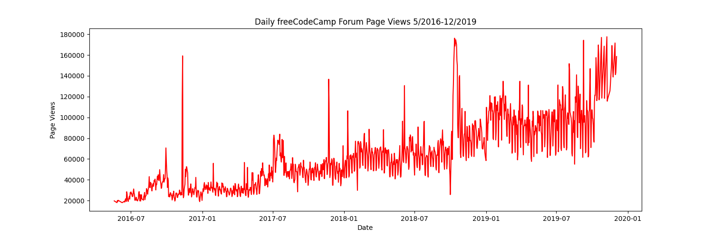
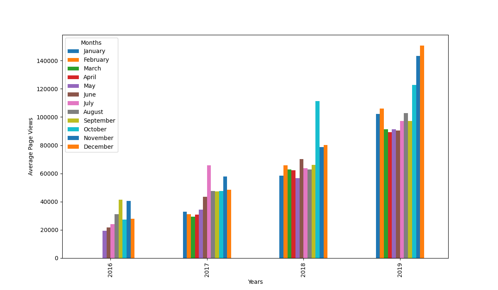
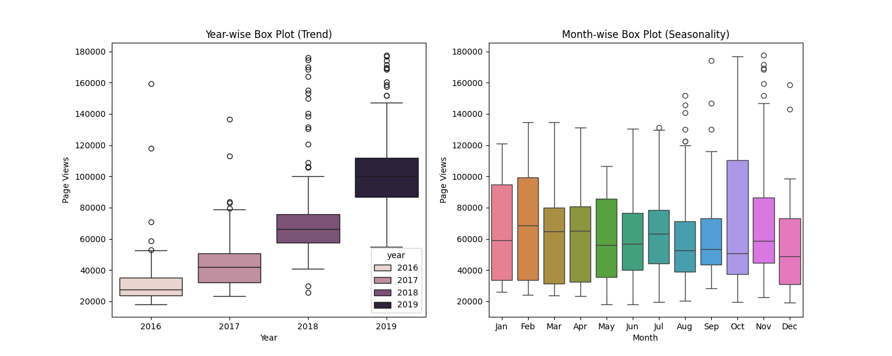

# Page View Time Series Visualizer

This project is part of the **Data Analysis with Python** certification from [freeCodeCamp](https://www.freecodecamp.org/). The goal is to visualize time series data using **line plots**, **bar plots**, and **box plots** to better understand data trends and seasonality.

## Project Structure

- `fcc-forum-pageviews.csv` — Dataset containing daily page views of the freeCodeCamp forum (May 2016 - December 2019).
- `time_series_visualizer.py` — Main script that performs data cleaning and plotting.
- `test_module.py` — Unit tests provided by freeCodeCamp to verify the implementation.
- `line_plot.png` — Output line plot.
- `bar_plot.png` — Output bar plot.
- `box_plot.png` — Output box plots.

## Visualizations

### 1. Line Plot

Shows daily page views over time to visualize long-term trends.

### 2. Bar Plot

Displays average monthly page views for each year, grouped by month.

### 3. Box Plots

- **Year-wise Box Plot** shows trends and spread in values over years.
- **Month-wise Box Plot** shows seasonality and month-to-month variation.

## How to Run

1. Clone the repository or download the files.
2. Ensure you have the required libraries:
   ```bash
   pip install pandas matplotlib seaborn
3. Run the main script:
   ```bash
   python time_series_visualizer.py
4. The script will generate three image files: line_plot.png, bar_plot.png, and box_plot.png

## Project Goals
- Practice data cleaning with Pandas
- Apply Seaborn and Matplotlib for data visualization.
- Learn how to analyze seasonality and trends using box and bar plots.

